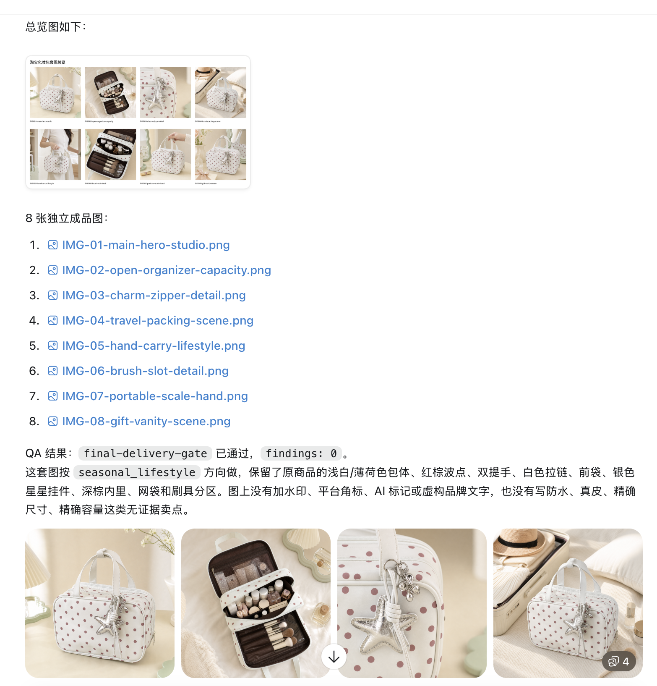

# SellerPilot Product Image Industrial

面向 Codex 的工业级电商商品图套图制作 skill。它不是一个“万能出图 prompt”，而是一套把商品理解、平台规范、营销文案、图像生成、QA、总览图和 tldraw 批注修订串起来的生产流程。

如果你是第一次接触 Codex skill，可以把它理解成：

- `SKILL.md`：给 Codex 看的操作手册。
- `scripts/`：可重复执行的检查、导出、画布、QA 小工具。
- `references/`、`platform-profiles/`、`workflows/`：按需读取的行业规则和流程资料。
- `assets/tldraw-review-workspace/`：用于看图、批注、截图回传的本地画布工作台。

## 最新更新

2026-07-10 版本重点增强了店铺统一风格记忆、ThinkAI 版继承和商业研究闭环：

- **店铺统一风格记忆**：用户可以在对话里说“创建店铺 xxx 的统一风格”并粘贴店铺地址；skill 会先分析店铺页面、给出 2-3 个统一风格方向，经过用户确认后才把店铺风格保存成 Markdown 记忆。后续生图只要提到该店铺或同一 URL，就会自动把这份 MD 作为店铺/品牌风格层加载。
- **双版本共享记忆能力**：原版 `sellerpilot-product-image-industrial` 和 ThinkAI 版 `sellerpilot-product-image-industrial-thinkai` 都继承店铺统一风格记忆流程；ThinkAI 版仍使用 `gpt-image-2`，但风格分析、确认和 MD 记忆写入逻辑保持一致。
- **Ozon 比例规则**：普通品类默认按 `3:4` 竖版商品图导出，Ozon Fresh 食品类等例外按平台 profile 或当前官方证据处理；导出 gate 会从当前任务的 `platform/category` 自动推断比例。
- **平台/品类偏好记忆**：用户明确确认过的某平台同类商品图片特质、风格方向、文案语气、陈列节奏和禁用项，会保存为 platform preference memory；后续同平台/同品类任务会先读取该记忆，再结合当前商品事实和最新调研决定是否采用。
- **商业设计研究计划**：当任务目标涉及“爆品图”“提升销售”“点击”“停留”或品类竞争时，skill 会生成 commerce design research plan，把点击钩子、停留机制、信任疑虑、买家问题、画廊叙事和文案节奏回写到套图蓝图与 QA 标准。
- **源素材规范化**：商品要进入白色 card、参数卡、对比卡或卖点信息图前，会生成透明商品母版或白卡安全母版，避免把带灰底/白底矩形的源图整张贴进 card。
- **本地化文案复核**：当目标语言属于俄语、德语、阿拉伯语这类复杂本地化场景时，正式出图前会再过一层 localized-copy-qa / translation-qa gate，检查源文案追溯、复核说明、回译或语义复核、局部市场语言依据，以及 RTL / 脚本方向。
- **最终成图文字复核**：本地化成品导出后，会对最终图片里的可见文字做轻量复核；优先使用 Codex 视觉检查或结构化复核记录，只有不确定时才使用 OCR，避免俄语/德语/阿拉伯语图片里残留中文海报字、源图文字或非目标语言。
- **验证闭环**：`npm run verify` 覆盖 Ozon 3:4 导出、平台记忆 apply/remember、商业设计研究 planner、总览图、tldraw 自动启动、跨任务图片隔离和 QA retry budget。

## 它能做什么

- 根据商品原图、商品 URL、竞品参考图、目标平台、国家/语言、目标人群和风格要求，规划并生成电商商品图套图。
- 支持 Amazon、TikTok Shop、小红书、拼多多、抖音、Temu、Shopee/Lazada、Etsy、Mercado Libre、SHEIN、Ozon、Wildberries 等平台基线。
- 在正式生产前，为粗略需求给出 2-3 个商业方向；用户不选时，harness 会自动选择一个方向继续。
- 从源图中提取商品身份、可见文字、尺寸线索、材料/结构/功能信息，并把这些事实传递到后续图像生成和 QA。
- 为 card/信息图/参数图生成透明或白卡安全商品素材，并检查商品底色与 card 背景是否一致。
- 针对时令、气候、节假日、区域趋势和营销热词创建平台上下文计划。
- 对 Ozon 普通品类默认执行 `3:4` 竖版商品图比例；Ozon Fresh 食品类等例外按平台 profile 或当前官方证据处理。
- 记住用户明确确认过的平台/品类风格偏好，例如某平台同类商品的图片比例、主图取向、文案语气、陈列节奏或禁用项，下次同平台同品类制作时自动套用为参考。
- 为单个用户店铺建立统一视觉风格记忆：先分析店铺 URL，提出 2-3 个方向，确认后保存为 Markdown；后续同店铺商品图会自动应用该风格层。
- 针对“爆品图”“提升销售”“点击”“停留”等目标，创建商业设计研究计划，把点击钩子、停留机制、信任疑虑和买家问题回写到套图蓝图、文案和 QA。
- 对最终图片文案做策略 gate，避免无证据的夸张卖点、内部 QA 语言、平台水印或系统标记。
- 强制保留商品套图总览图，但在日常高质量成品中收敛规划和报告产物，避免把完整工业审计包误跑成普通出图流程。
- 用身份一致性、几何比例、物理功能、导出规范、总览图和 QA loop guard 降低“生造功能”“商品变形”“多任务图片串流”等风险。
- 多图成品在生图导出和总览图完成后自动启动 tldraw 画布，让用户直接批注，然后把批注转换成修订任务。

## 它不能做什么

- 不能保证 CTR、CVR、ROAS、ACOS、销量或排名提升。
- 不能替你发布、上传或上架商品。
- 不能编造认证、安全、防水、防火、医疗、儿童/宠物安全等高风险声明。
- 不能把竞品图当成你的商品原图，也不能复制竞品视觉。
- 不能在没有源图或明确证据时声称“身份保持一致”。
- 不能把确定性 layout draft 冒充最终 AI 生成图。

## 准备环境

推荐环境：

- Codex Desktop 或支持本地 skills 的 Codex 环境。
- Node.js 20 或更新版本。
- npm。
- 可选：`tesseract`，用于 AI 视觉识别不确定时本地 OCR 兜底读取源图文字。
- 可选：Google Chrome、Microsoft Edge 或 Playwright 浏览器，用于 HTML/画布渲染。
- 可选：ThinkAI API key。只有安装或显式选择 ThinkAI `gpt-image-2` 版时才需要。

Codex runtime 通常已经带有 `sharp` 和 `playwright`。普通 Node 环境可以运行：

```bash
npm install
```

### 双版本选择

这个仓库维护同一套工业级商品图工作流，但可以安装成两个 skill 名称，让用户在对话里自由选择：

- `sellerpilot-product-image-industrial`：原版，默认使用 Codex `imagegen` / `image_gen` 作为生产生图执行层。
- `sellerpilot-product-image-industrial-thinkai`：ThinkAI 版，默认使用 ThinkAI OpenAI-compatible runtime，模型固定为 `gpt-image-2`。

两个版本可以同时安装在 `${CODEX_HOME:-$HOME/.codex}/skills/` 下。日常对话里直接点名即可：

```text
请使用 $sellerpilot-product-image-industrial 为 Amazon US 做 7 张 listing 图片。
```

```text
请使用 $sellerpilot-product-image-industrial-thinkai 为 Amazon US 做 7 张 listing 图片。
```

### 店铺统一风格记忆

如果你希望同一个店铺未来的商品图保持统一视觉风格，可以直接在 Codex / ChatGPT 的 Codex agent 对话里说：

```text
请使用 $sellerpilot-product-image-industrial 创建店铺 Luna Bridal 的统一风格，店铺地址是 https://example.com/store
```

ThinkAI 版也支持同样流程：

```text
请使用 $sellerpilot-product-image-industrial-thinkai 创建店铺 Luna Bridal 的统一风格，店铺地址是 https://example.com/store
```

Codex 会先分析店铺页面证据，给出 2-3 个统一风格方向，并询问少量关键偏好。只有你确认最终方向后，它才会写入持久 Markdown 记忆。后续生图可以这样调用：

```text
请使用 $sellerpilot-product-image-industrial 为 Luna Bridal 这个店铺生成 Amazon US 婚礼包 7 图套图，沿用店铺统一风格。
```

店铺风格记忆默认保存到：

```text
${SELLERPILOT_IMAGE_SKILL_MEMORY:-$HOME/.codex/sellerpilot-product-image-industrial}/store-style-memory/*.md
```

这份 MD 只保存店铺/品牌风格层，例如定位、受众、配色、字体、摄影方向、版式节奏、文案语气和禁用项；它不会覆盖当前商品原图身份、平台规则、物理事实、合规边界或用户本次明确要求。

### ThinkAI gpt-image-2 运行时

ThinkAI 版使用本仓库的 `scripts/thinkai-image-runtime.mjs`。最简单的配置方式是设置环境变量：

```bash
export THINKAI_API_KEY="<YOUR_THINKAI_API_KEY>"
```

也可以让 Codex 写入安装目录里的本地配置文件；这个文件已被 `.gitignore` 排除：

```bash
cd ${CODEX_HOME:-$HOME/.codex}/skills/sellerpilot-product-image-industrial-thinkai
npm run configure:thinkai -- --api-key "<YOUR_THINKAI_API_KEY>"
```

运行时默认 base URL 是 `https://www.thinkai.tv/v1`，默认模型固定为 `gpt-image-2`。可用 dry-run 检查请求快照，不会真实调用网络：

```bash
npm run generate:thinkai -- \
  --prompt "verify dry run" \
  --output-dir /tmp/sellerpilot-thinkai-dry-run \
  --dry-run
```

带源图引用时会走 `/images/edits`：

```bash
npm run generate:thinkai -- \
  --prompt "preserve this product identity and create a clean ecommerce hero image" \
  --image /abs/source-product.png \
  --output-dir /tmp/sellerpilot-thinkai-edit-dry-run \
  --dry-run
```

## 安装到 Codex

安装完成后，通常需要重启 Codex，让新的 skill 列表重新加载。两个版本默认安装位置是：

```text
${CODEX_HOME:-$HOME/.codex}/skills/sellerpilot-product-image-industrial
${CODEX_HOME:-$HOME/.codex}/skills/sellerpilot-product-image-industrial-thinkai
```

### 方式 1：在 Codex / ChatGPT 的 Codex agent 对话里安装原版

适合不想手动打开终端、只安装原版 Codex imagegen 的用户。把下面这段话直接发给 Codex：

```text
请使用 skill-installer 从 GitHub 安装这个 Codex skill：

https://github.com/ninemouth/sellerpilot-product-image-industrial

注意：这个 skill 位于仓库根目录，请使用 --path .，并把安装后的 skill 名称设为 sellerpilot-product-image-industrial。安装完成后请验证 SKILL.md 存在，并提醒我重启 Codex。
```

Codex 应该会使用内置的 `skill-installer`。安装成功后，重启 Codex。

### 方式 2：在 Codex / ChatGPT 的 Codex agent 对话里安装 ThinkAI 版

ThinkAI 版是从同一仓库构建出来的完整 skill 包，避免在 GitHub 里维护两份重复源码。把下面这段话直接发给 Codex：

```text
请帮我安装 ThinkAI 版 SellerPilot 商品图 skill：

1. clone 或更新 https://github.com/ninemouth/sellerpilot-product-image-industrial 到本机临时/开发目录。
2. 进入仓库后运行 npm install。
3. 运行 npm run verify。
4. 运行 npm run build:variant:thinkai。
5. 运行 npm run sync:thinkai，把生成的 dist/sellerpilot-product-image-industrial-thinkai 安装到 ${CODEX_HOME:-$HOME/.codex}/skills/sellerpilot-product-image-industrial-thinkai。
6. 安装后请验证 SKILL.md 的 name 是 sellerpilot-product-image-industrial-thinkai。
7. 检查是否已有 THINKAI_API_KEY 环境变量；如果没有，请向我索取 ThinkAI API key。
8. 拿到 key 后运行：
   cd ${CODEX_HOME:-$HOME/.codex}/skills/sellerpilot-product-image-industrial-thinkai
   npm run configure:thinkai -- --api-key '<我提供的KEY>'
9. 验证 ${CODEX_HOME:-$HOME/.codex}/skills/sellerpilot-product-image-industrial-thinkai/.thinkai-image-runtime.json 存在、权限尽量为 600、model 是 gpt-image-2。不要在回复里打印 key。
10. 运行一次不联网不扣费的 dry-run：
   npm run generate:thinkai -- --prompt 'verify dry run' --output-dir /tmp/sellerpilot-thinkai-dry-run --dry-run
11. 完成后提醒我重启 Codex。

不要覆盖 sellerpilot-product-image-industrial 原版。
```

如果只需要补配 key，可以继续在对话里让 Codex 执行：

```text
请帮我配置 ThinkAI 版 SellerPilot 商品图 skill 的 API key：

1. 检查 ${CODEX_HOME:-$HOME/.codex}/skills/sellerpilot-product-image-industrial-thinkai 是否存在。
2. 如果当前环境没有 THINKAI_API_KEY，请向我索取 ThinkAI API key。
3. 拿到 key 后进入安装目录并运行：
   npm run configure:thinkai -- --api-key '<我提供的KEY>'
4. 验证 .thinkai-image-runtime.json 存在、model 是 gpt-image-2、权限尽量为 600。
5. 不要在回复里打印 key，不要把 .thinkai-image-runtime.json 提交到 Git。
```

### 方式 3：在终端用 skill-installer 安装原版

适合新机器首次安装，或者你想明确看到安装命令时使用：

```bash
python3 ${CODEX_HOME:-$HOME/.codex}/skills/.system/skill-installer/scripts/install-skill-from-github.py \
  --repo ninemouth/sellerpilot-product-image-industrial \
  --path . \
  --name sellerpilot-product-image-industrial
```

因为这个仓库的 skill 文件就在仓库根目录，所以必须显式指定：

```text
--path .
--name sellerpilot-product-image-industrial
```

如果看到 `Destination already exists`，说明本机已经安装过同名 skill。安装器会避免覆盖已有 skill，这是正常保护。

### 方式 4：clone 仓库后同步安装原版或 ThinkAI 版

适合开发者、本地修改者，或者需要从 GitHub 拉取后先验证再安装的用户。

把仓库 clone 到任意开发目录：

```bash
git clone https://github.com/ninemouth/sellerpilot-product-image-industrial.git
cd sellerpilot-product-image-industrial
```

验证开发目录：

```bash
npm run verify
```

同步原版到 Codex skills 目录：

```bash
npm run sync:codex
```

构建并同步 ThinkAI 版：

```bash
npm run build:variant:thinkai
npm run sync:thinkai
```

同步脚本会先备份旧版本，再把对应 skill 包同步到 Codex skills 目录，并验证两边文件一致。`sync:codex` 和 `sync:thinkai` 使用不同安装名，因此可以并存。

### 方式 5：更新已经安装过的 skill

如果你用方式 4 保留了本地 clone，推荐这样更新原版：

```bash
cd sellerpilot-product-image-industrial
git pull
npm run verify
npm run sync:codex
```

更新 ThinkAI 版：

```bash
cd sellerpilot-product-image-industrial
git pull
npm run verify
npm run build:variant:thinkai
npm run sync:thinkai
```

如果你之前只用 GitHub installer 安装，没有保留本地 clone，可以重新 clone 到任意目录，再执行方式 4 的验证和同步。

不要直接手动覆盖 `${CODEX_HOME:-$HOME/.codex}/skills/sellerpilot-product-image-industrial`，除非你已经备份旧目录。

### 方式 6：在 Codex 对话中要求更新并复核

如果你只是想让 Codex 在新对话里先检查是否有更新，再决定是否继续生产，可以直接发：

```text
请先检查 sellerpilot-product-image-industrial 和 sellerpilot-product-image-industrial-thinkai 是否有更新。如果有新版，请先问我是否更新，再继续生产；如果没有更新，直接继续。
```

当目标语言是俄语、德语、阿拉伯语这类本地化文案时，还会自动加上 localized-copy-qa / translation-qa 复核，避免直接把未复核的翻译文案送进正式出图。

### 方式 7：安装到临时目录做验证

适合只想检查 GitHub 安装包是否完整，不想影响当前 Codex 环境：

```bash
tmp_dir="$(mktemp -d /tmp/sellerpilot-skill-install-XXXXXX)"
python3 ${CODEX_HOME:-$HOME/.codex}/skills/.system/skill-installer/scripts/install-skill-from-github.py \
  --repo ninemouth/sellerpilot-product-image-industrial \
  --path . \
  --name sellerpilot-product-image-industrial \
  --dest "$tmp_dir"
test -f "$tmp_dir/sellerpilot-product-image-industrial/SKILL.md" && echo "install package looks OK"
```

### 方式 8：手动复制安装（不推荐）

只在目标目录不存在时使用：

```bash
mkdir -p ${CODEX_HOME:-$HOME/.codex}/skills
test ! -e ${CODEX_HOME:-$HOME/.codex}/skills/sellerpilot-product-image-industrial && \
  cp -R sellerpilot-product-image-industrial ${CODEX_HOME:-$HOME/.codex}/skills/sellerpilot-product-image-industrial
```

手动复制不会自动验证、不会自动备份、也不会检查安装目录是否和源码一致。除非你很清楚自己在做什么，否则优先使用方式 1、2 或 3。

## 最快上手

安装后，在 Codex 对话里可以这样说：

```text
请使用 $sellerpilot-product-image-industrial，根据这张商品原图，为 Amazon US 做 7 张 listing 图片。
```

或者更自然一点：

```text
这是一款女包，目标平台拼多多，帮我做 8 张商品套图，风格偏通勤轻奢。
```

如果信息足够，skill 会继续推进；如果缺少会影响质量或真实性的关键信息，它只会问 1-3 个高价值问题。低风险缺口会用明确假设继续。

## 运行模式

这个 skill 不是永远使用 fast generation mode。它会根据任务目标选择最轻但能保护图片质量的模式：

- `fast_generation`：单张、低风险、草稿或用户明确要求快速时使用。
- `quality_production`：高质量商品套图和最终成品的默认模式。它会保留源图理解、身份锁、紧凑套图规划、视觉导演、prompt layer、anchor batch、关键 QA 和总览图，但不会默认生成完整工业审计包。
- `revision_repair`：用户给出批注、截图对比或要求修改已有图片时使用，只重跑受影响资产。
- `industrial_audit`：用户要求完整 workflow、迁移 SellerPilot、gate report、审计证据或开发验证时使用。
- `debug_development`：开发、自测、回归验证时使用。

可以手动查看某个请求会进入哪个模式：

```bash
npm run route:mode -- \
  --out-dir /tmp/sellerpilot-mode-demo \
  --user-text "为拼多多女包生成8图高质量套图，包含场景图" \
  --image-count 8 \
  --quality-target high \
  --has-source-image true \
  --scene-requested true
```

高质量多图套图应该返回：

```text
selected_mode: quality_production
```

可以为一次生产创建效率计划：

```bash
npm run plan:efficiency -- \
  --run-dir runs/demo-amazon-bag \
  --mode-report runs/demo-amazon-bag/mode/production-mode-router-report.json \
  --image-count 8 \
  --has-source-image true
```

这个计划不会降低成图质量。它的作用是把完整工业工作流收敛为当次任务真正需要的质量路径：保留源图理解、身份锁、紧凑套图规划、prompt layer、anchor batch、关键 QA、总览图和最终画布；跳过未触发的 URL 读取、完整市场研究、完整爆品挖掘、预生成画布和多份长报告。

高质量多图任务还会写入 `generated-assets/generation-progress.json`。每生成一张图都应更新 completed / pending / failed；导出 manifest 后如果发现进度文件落后，可以用 `npm run progress:reconcile` 从当前 run 的 manifest 回填进度，避免已经完成的图片因为机械进度文件过期而反复重跑。长任务超过 15 分钟，或最终导出后进入 QA/交付收口前，应运行 runtime watchdog，判断当前是在正常等待生图/网络、QA gate 空转、成品已有但未收口，还是已经无进展卡住。

## 推荐输入

效果最好时，给 Codex：

- 商品主图或多角度源图。
- 商品链接。
- 目标平台和国家/语言。
- 希望生成几张图。
- 商品卖点或不能夸大的点。
- 可参考但不能复制的竞品图。
- 目标人群、季节、使用场景或风格偏好。

如果源图里有文字、尺寸、型号、警告、材料、兼容性或安装信息，skill 会尝试识别并锁定这些事实。

如果商品需要放入白色卡片、参数卡、功能卡或对比卡，最好提供干净商品图；skill 会尝试生成 `source-normalized/product-cutout-transparent.png` 和 `source-normalized/product-on-card-safe.png`，用于后续排版，避免出现商品灰底矩形和 card 白底不一致的问题。

## 输出通常包含

`quality_production` 默认输出：

- 独立的最终图片文件。
- 稳定 ID + 英文用途 slug 的文件名。
- 多图套图的 `overview/SET-OVERVIEW-contact-sheet.png` 总览图。
- 当前任务的 `export/final-images-manifest.json`，用于证明没有跨任务混图。
- `planning/production-efficiency-plan.json`，用于说明本次哪些工作会触发、哪些会跳过、阶段预算和长耗时进度规则。
- `blueprint/quality-production-blueprint.json` 紧凑套图规划，保留每张图的角色、买家问题、镜头、文案意图、prompt layer 和 QA 标准。
- 商品身份锁和源图理解摘要，包括 AI 视觉读取文字和条件 OCR 兜底提供的尺寸、型号、功能、标签等事实线索。
- 源素材规范化结果，例如透明商品母版、白卡安全母版和 `source-normalized/product-normalization-report.json`。
- 必要时的物理功能锁、几何比例锁或微细节锁。
- 镜头矩阵、场景策略、文案策略和 prompt layer 摘要。
- 匹配到的平台/品类偏好记忆，例如同平台同类商品延续的视觉特质、风格方向、文案语气和禁用项。
- 转化关键任务的商业设计研究计划，例如点击钩子、用户停留机制、信任疑虑处理和爆品模式借鉴边界。
- Anchor batch QA 结论，以及后续只补齐缺失/失败图片的说明。
- 相关 QA 结论：身份、物理/几何、文案、本地化最终可见文字、营销、导出、最终交付。
- 商品底图/card 一致性 QA，避免最终图中出现可见灰底矩形、商品底色和白卡底色不一致。
- 生图完成后的 tldraw review session URL。多图最终成品会在导出和总览图完成后自动创建并启动画布；单图草稿可跳过，除非用户要求审核或 gate 失败。

`fast_generation` 会输出更精简的成品、摘要和 QA；它主要用于单图、草稿或明确速度优先的任务。

Industrial audit mode 会额外输出完整的 fact sheet、策略、prompt layer、gate report、QA loop routing、修订历史和导出包摘要。

## 交付示例

下面是一次商品套图交付在 Codex 对话中的展示样例：包含套图总览图、8 张独立成品图文件、final delivery QA 结果，以及部分图片预览。



## 常用脚本

验证整个 skill：

```bash
npm run verify
```

检查当前安装版是否落后于 GitHub：

```bash
npm run check:update -- --cache-ttl-hours 24 --timeout-ms 1500
```

选择生产模式：

```bash
npm run route:mode -- \
  --out-dir /tmp/sellerpilot-mode-demo \
  --user-text "为拼多多女包生成8图高质量套图" \
  --image-count 8 \
  --quality-target high
```

生成效率计划：

```bash
npm run plan:efficiency -- \
  --run-dir runs/demo-amazon-bag \
  --mode-report runs/demo-amazon-bag/mode/production-mode-router-report.json \
  --image-count 8 \
  --has-source-image true
```

生成透明/白卡安全商品母版：

```bash
npm run normalize:source-asset -- \
  --input runs/demo-amazon-bag/source-enhanced/source-enhanced.png \
  --out-dir runs/demo-amazon-bag/source-normalized \
  --card-color "#ffffff"
```

检查商品底图和 card 背景是否一致：

```bash
npm run qa:product-background -- \
  --copy-json runs/demo-amazon-bag/blueprint/panels.json \
  --run-dir runs/demo-amazon-bag \
  --out-dir runs/demo-amazon-bag/qa
```

导出后同步/修复生图进度文件：

```bash
npm run progress:reconcile -- \
  --run-dir runs/demo-amazon-bag \
  --manifest runs/demo-amazon-bag/export/final-images-manifest.json
```

这个命令只根据当前任务的 `export/final-images-manifest.json` 更新 `generated-assets/generation-progress.json`，不会重新生图，也不会替代 anchor batch QA。它用于修复“图片已经导出，但进度仍显示 planned / not_started”的卡点。

长任务/卡点诊断：

```bash
npm run watchdog:runtime -- \
  --run-dir runs/demo-amazon-bag
```

它会写入 `qa/runtime-watchdog-report.json`，常见分类包括：

- `active_generation_wait`：还在合理等待生图或网络，继续 pending assets。
- `gate_churn_detected`：QA 重试预算耗尽，停止自动重生图，修最早失败 gate。
- `ready_but_not_closed`：final manifest 已有图，但 overview/tldraw/final handoff 没收口，不要重生图。
- `blocked_stalled_no_progress`：超过阈值且无文件进展，停止自动流程并汇报最小下一步。

生图完成后启动/复用 tldraw 画布：

```bash
npm run launch:canvas -- \
  --run-dir runs/demo-amazon-bag \
  --manifest runs/demo-amazon-bag/export/final-images-manifest.json \
  --title "商品图审核工作台"
```

这个命令会读取当前任务的 final-images manifest，创建 `review-workspace/`，把图片作为 tldraw 底层锁定图形导入，并默认启动或复用共享 tldraw 服务。用户在画布中标注后点击 **Complete Review**，本地服务会把交接数据写回 `review-workspace/data/review-completion.json`，并生成 `review-workspace/data/review-completion-ready.json`。Codex 随后可以运行 `wait-for-review-completion.mjs` 自动解析成 `generation-tasks.json` 并继续只修改受影响图片。自测或只想生成文件时才加 `--no-auto-start`。

等待画布完成并转换为修订任务：

```bash
node scripts/wait-for-review-completion.mjs \
  --workspace-dir runs/demo-amazon-bag/review-workspace \
  --run-dir runs/demo-amazon-bag \
  --session-id demo-amazon-bag
```

创建任务目录：

```bash
node scripts/create-run-skeleton.mjs \
  --out-dir runs/demo-amazon-bag \
  --platform "Amazon" \
  --category "women bag" \
  --product-name "demo bag"
```

创建平台上下文计划：

```bash
node scripts/platform-context-planner.mjs \
  --run-dir runs/demo-amazon-bag \
  --platform "Amazon" \
  --category "women bag" \
  --season "summer"
```

应用同平台/同品类偏好记忆：

```bash
npm run memory:platform -- \
  --mode apply \
  --platform "Ozon" \
  --category "women bag" \
  --locale "ru-RU" \
  --run-dir runs/demo-ozon-bag
```

当用户明确确认某个平台/品类风格后，可以记住它：

```bash
npm run memory:platform -- \
  --mode remember \
  --platform "Ozon" \
  --category "women bag" \
  --locale "ru-RU" \
  --trait "3:4 portrait first image with clean marketplace readability" \
  --style "minimal premium detail gallery" \
  --copy-tone "short Russian benefit phrasing" \
  --source-note "user_confirmed_platform_style_trait"
```

记忆只保存平台/品类层面的视觉、文案和陈列偏好，不保存商品身份、私密业务信息、客户/供应商信息、无证据声明或一次失败反馈。

创建店铺统一风格草稿：

```bash
npm run memory:store-style -- \
  --mode draft \
  --store-name "Luna Bridal" \
  --store-url "https://example.com/store" \
  --platform "Amazon" \
  --category "bridal clutch" \
  --analysis "Store reads as soft bridal, pearl detail, warm neutral styling." \
  --recommendation "Elegant warm ivory bridal system with restrained typography." \
  --run-dir runs/demo-luna-bridal
```

用户确认方向后保存为持久 Markdown 记忆：

```bash
npm run memory:store-style -- \
  --mode remember \
  --store-name "Luna Bridal" \
  --store-url "https://example.com/store" \
  --confirmed true \
  --confirmed-by user \
  --positioning "soft premium bridal accessories" \
  --visual-trait "warm ivory backgrounds with pearl-detail closeups" \
  --palette "ivory, champagne gold, soft shadow gray" \
  --typography "thin elegant serif for headlines, simple sans for specs" \
  --photography "macro pearl texture, hand-held bridal scene, clean tabletop hero" \
  --layout "airy composition with product dominant and small trust details" \
  --copy-tone "short graceful bridal wording" \
  --avoid "no loud discount badges or unrelated party props" \
  --prompt-directive "apply store style as a brand layer after product identity lock" \
  --evidence "confirmed after store URL review and user approval"
```

后续任务加载店铺风格：

```bash
npm run memory:store-style -- \
  --mode apply \
  --store-name "Luna Bridal" \
  --run-dir runs/demo-luna-bridal
```

创建商业设计研究计划：

```bash
npm run plan:commerce-research -- \
  --run-dir runs/demo-ozon-bag \
  --platform "Ozon" \
  --category "women bag" \
  --locale "ru-RU" \
  --goal both \
  --research-depth compact
```

这个计划用于把“平台/商品/爆品图研究”收敛成可执行字段：点击钩子、停留机制、信任疑虑、买家问题、画廊叙事、文案节奏，以及需要回写到套图蓝图和 QA 的标准。

运行 QA loop router：

```bash
node scripts/qa-loop-router.mjs --run-dir runs/demo-amazon-bag
```

同步到 Codex：

```bash
npm run sync -- --source "$PWD"
```

## Production 更新检查

所有 production request 的第一步都会先检查本地安装版是否落后于 GitHub，但不会在未获授权时自动覆盖安装目录。

检查命令是：

```bash
node ${CODEX_HOME:-$HOME/.codex}/skills/sellerpilot-product-image-industrial/scripts/check-skill-update.mjs \
  --cache-ttl-hours 24 \
  --timeout-ms 1500
```

可能返回：

- `current`：当前安装版和 GitHub `main` 一致，静默继续任务。
- `update_available`：安装版落后于 GitHub，Codex 必须先询问是否现在更新；用户选择前不进入生产规划、生图、QA 或画布启动。
- `unknown_local_revision` / `unknown_remote_revision`：无法确认版本，例如网络不可达、没有 release metadata 或远端超时。此时不阻塞出图，但不能声称当前安装版已是最新。

为什么不完全自动更新：

- Codex skill 是本地能力目录，覆盖前应该备份并验证。
- 用户可能正在使用本地开发版或临时改动版。
- 自动更新可能改变当前任务行为，尤其是长任务或正在修订的图片生产流程，所以发现新版时先询问用户。

用户确认更新后，推荐更新流程是：

```bash
git pull
npm run verify
npm run sync -- --source "$PWD"
```

`npm run sync` 会备份旧安装版、同步当前源码、验证开发目录和安装目录一致，并写入 `.sellerpilot-skill-release.json`。后续 `check:update` 会用这个 release metadata 判断本地安装版是否落后于 GitHub。

## QA 和防循环机制

这个 skill 的 QA 不是装饰性报告。关键 gate 失败后，`qa-loop-router.mjs` 会判断最早应该回到哪个节点，只重跑受影响的资产或布局。

同一个失败签名会记录在：

```text
qa/qa-loop-state.json
```

如果同一失败超过 retry budget，router 会输出：

```text
blocked_retry_budget_exhausted
```

这表示必须停止自动重生图，改为请求更好的源图、用户事实确认、方向调整或人工接受阻塞状态。

## 目录结构

```text
.
├── SKILL.md                         # Codex 触发后读取的主说明
├── AGENTS.md                        # 项目级执行规则
├── scripts/                         # 验证、导出、画布、QA、同步脚本
├── references/                      # 按需读取的细分规则
├── platform-profiles/               # 平台基线
├── workflows/                       # 平台/场景工作流
├── templates/                       # 结构化产物模板
├── policies/                        # 风险和 QA 边界
├── assets/tldraw-review-workspace/  # 本地批注画布
├── tests/                           # 行为用例说明
└── work/                            # 本地临时开发产物，不应提交真实任务输出
```

## 安全和合规边界

- 不要把用户私有商品图、竞品素材或真实客户数据提交到这个仓库。
- `runs/`、`outputs/`、`work/*` 默认被 `.gitignore` 排除。
- 生成图片前要保留源商品身份：形状、颜色、材质、结构、核心组件。
- 涉及认证、安全、医疗、防水、防火、儿童/宠物安全等声明时，必须有证据，否则标记风险或移除。
- 竞品图只能用于差异化分析，不能复制布局、品牌、视觉资产或文案。

## 故障排查

`npm run verify` 提示缺少 `sharp` 或 `playwright`：

```bash
npm install
```

tldraw 画布无法启动：

```bash
cd assets/tldraw-review-workspace
npm install
npm run build
```

OCR 没有结果：

- 这是兜底工具，不是第一优先级；先用 AI 视觉识别原图文字。
- 如果 AI 明确判断没有文字，可以跳过 OCR。
- 如果 AI 不确定、文字太小/模糊/倾斜，或疑似包含尺寸、型号、警告、安装、认证等关键事实，再确认系统安装了 `tesseract` 或提供更清晰的近拍图。

最终交付被 QA 阻塞：

- 先运行 `npm run watchdog:runtime -- --run-dir <run-dir>` 判断是等待、生图失败、gate 空转，还是已生成未收口。
- 查看 `qa/qa-loop-routing-decision.json`。
- 查看 `qa/qa-loop-state.json` 是否已经超过重试预算。
- 按 `return_node` 修最小上游节点，不要整套重做。

## 开源协议

MIT License。详见 [LICENSE](LICENSE)。
